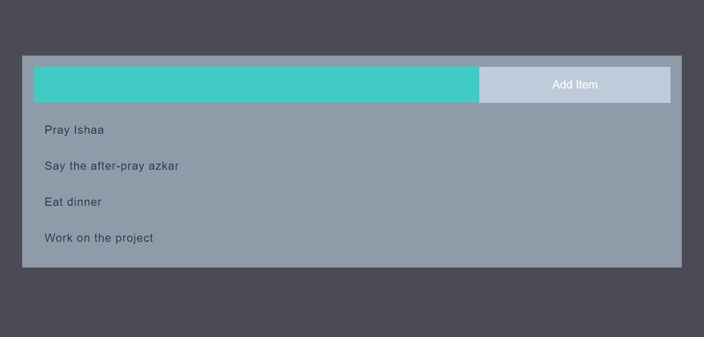

# TODO-List

## A small TODO application that have add, remove TODO items.

### It is connected via cloud database provided by mongodb cloud to store the items inserted in the TODO List as long as it isn't **deleted by clicking on it**.

### The application built using **Node.js**, **Express.js**, **AJAX**,and **mongoDB**.

### To run the application:

#### 1. Make sure you've installed Node.js & npm.

#### 2. Open the terminal in the project directory and type the following command:

        npm install

#### 3. After that make sure the everything done correctly and mongoose, express, ejs, nodemon,and body-parser have been installed correctly.

#### 4. After that just type the following command:

        nodemon app.js

#### 5. Open your browser and enter the url:

        http://localhost:3000/todo

#### Screenshot for the application

